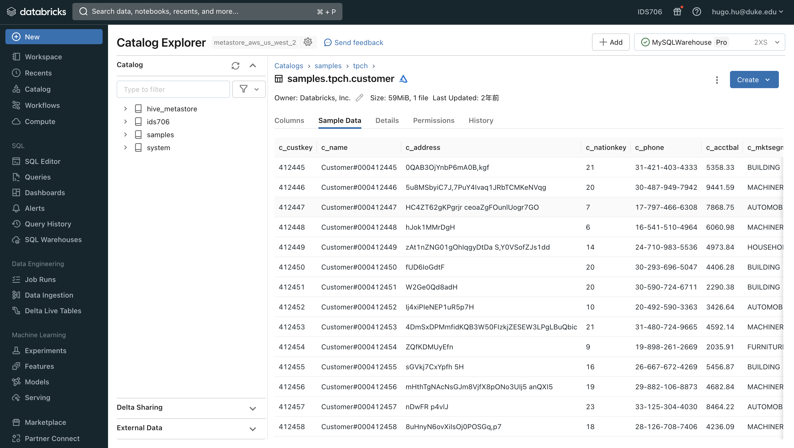
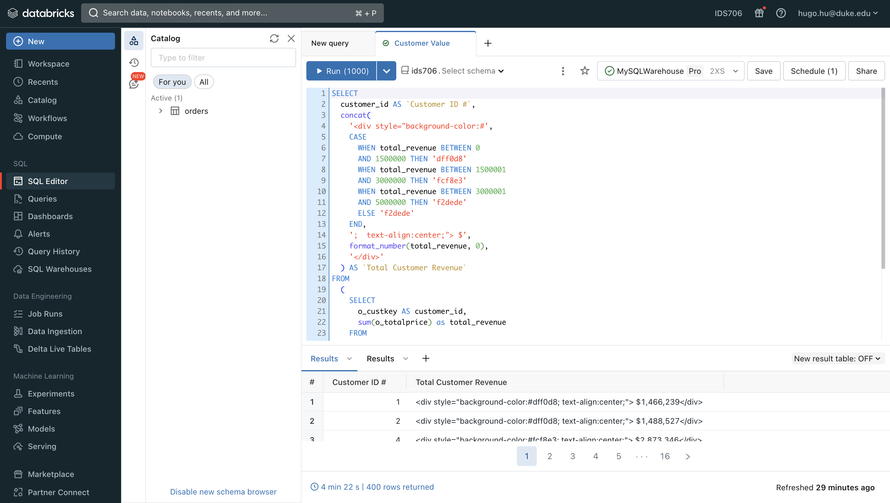
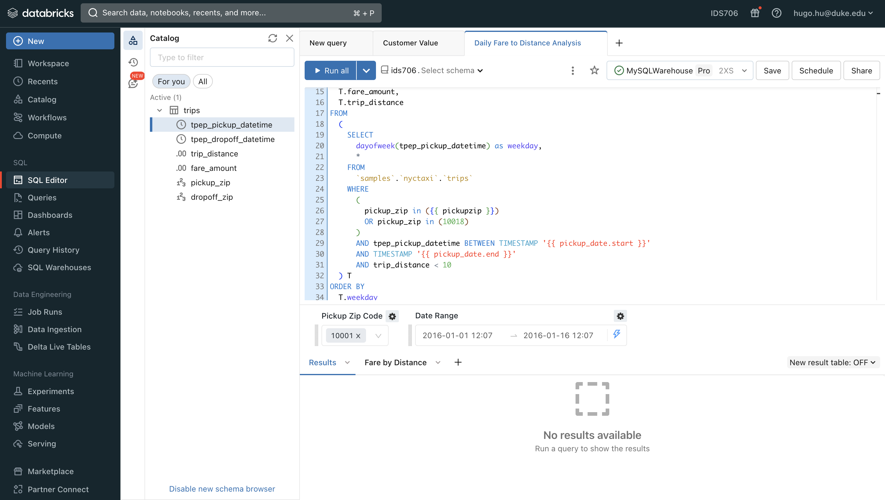
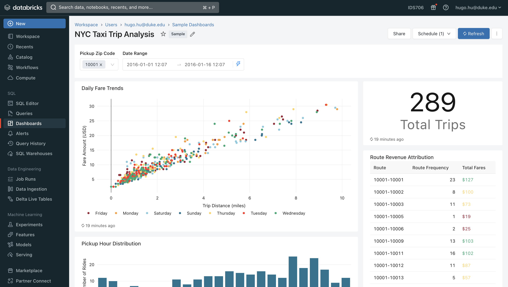
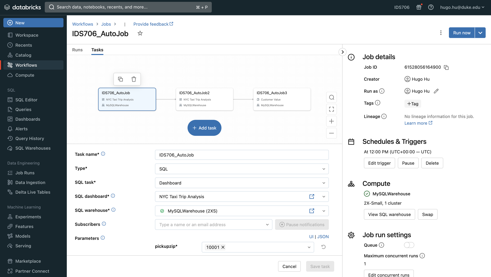
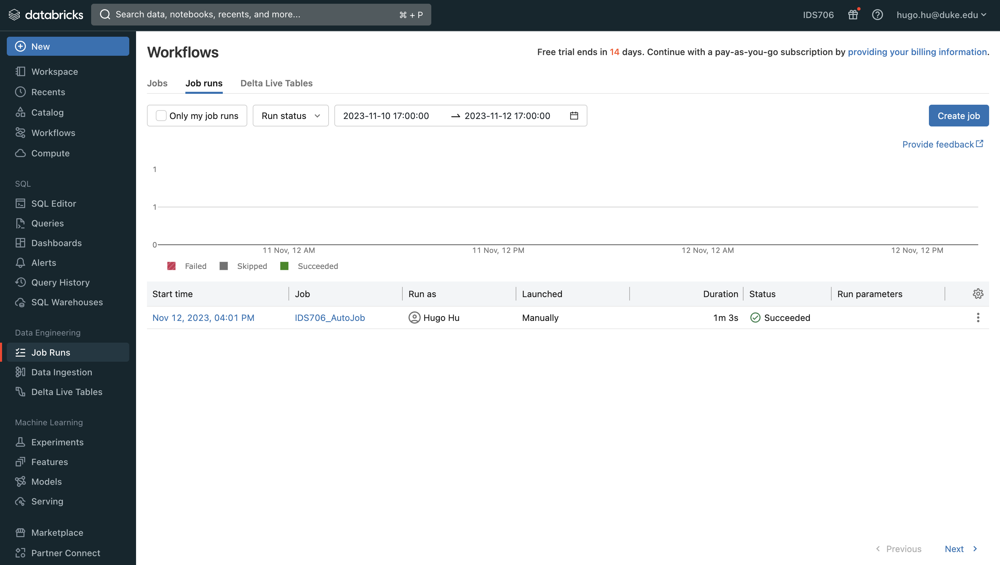

## Week 11 Mini-project

> © Yadong (Hugo) Hu 2023
> 
> This project was generated by this [Awesome Template](https://github.com/0HugoHu/IDS706-Python-Template)

<br />

**Requirements: Create a data pipeline using the Databricks platform.**


## Project Description
This is an example showing the DataBricks pipeline and workflow adapted from official SQL dashboard sample.

## Result
### Ingest Data
This example uses the [NYC Taxi & Limousine Commission - yellow taxi trip records](https://learn.microsoft.com/en-us/azure/open-datasets/dataset-taxi-yellow?tabs=azureml-opendatasets) dataset.

The dataset is automatically preloaded in the Databricks environment under ```user_name/samples/tpch``` folder.




### Query Data
The data is queried using SQL language in several different files.

Here, it shows the customer revenue by year and month:



### Analyze Data
Some data is further analyzed within other SQL queries.

Here, it shows the daily fare to distance analysis:



### Visualize Data
Finally, some key metrics are visualized using the Databricks dashboard.



You can see the full report pdf [here](.tutorial/NYC%20Taxi%20Trip%20Analysis%20-%20November%2012,%202023%204_02%20PM.pdf).


### Workflow
The workflow is set up by executing three different visualization dashboards (inside they are SQL queries) and then combine them together.

The job is scheduled to run every day at 12:00 PM UTC.



Here's the executing history:



## Run

### Some Makefile Commands
```commandline
make clean
make install
make format
make lint
make test
make run
```
